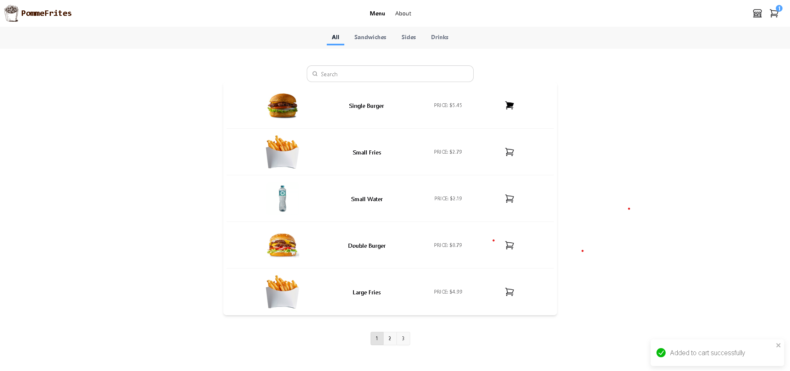
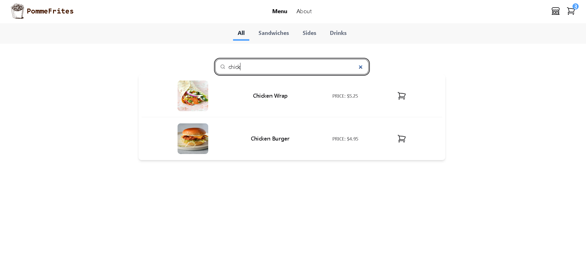
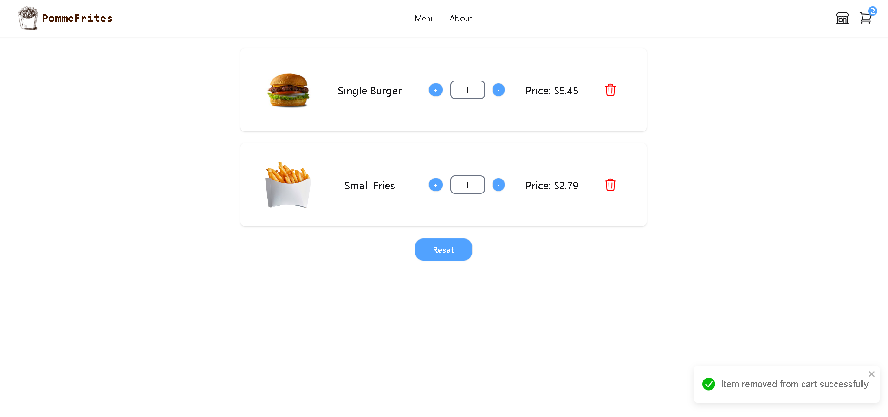
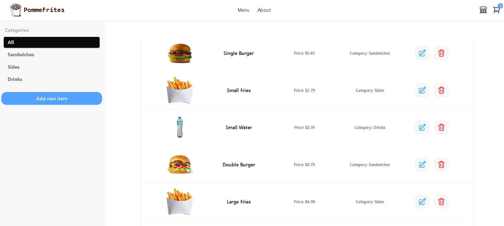
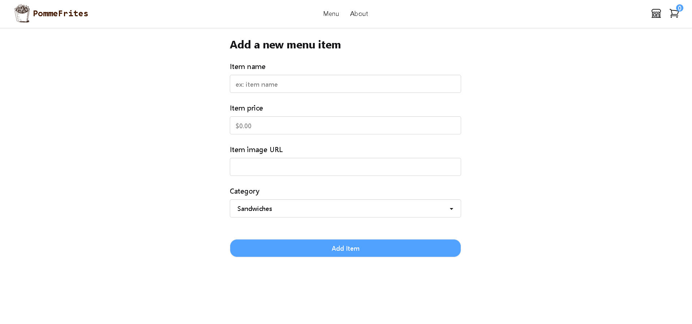
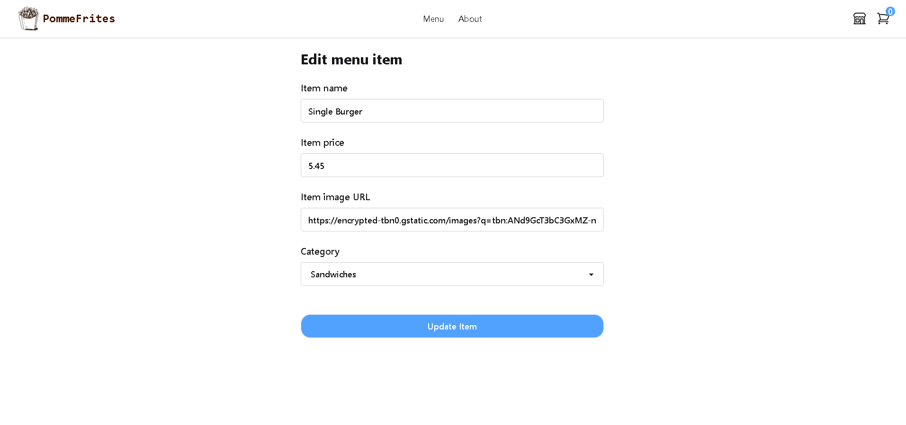
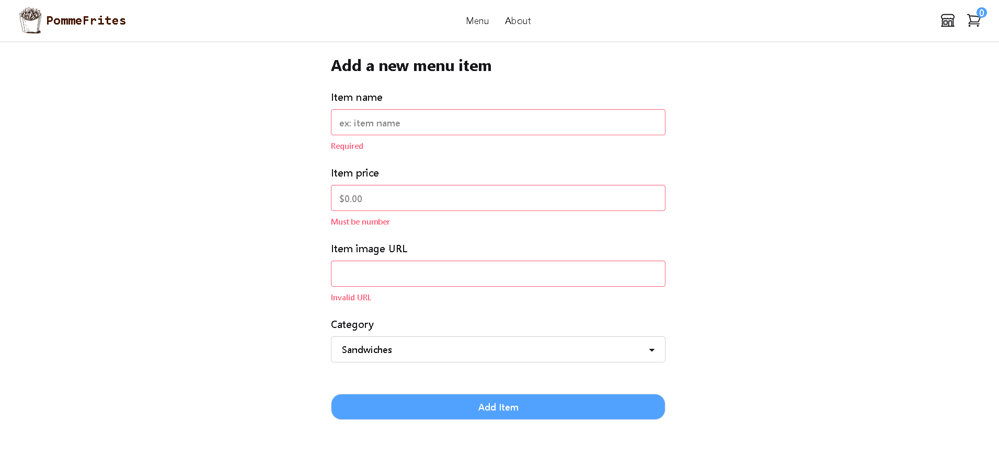
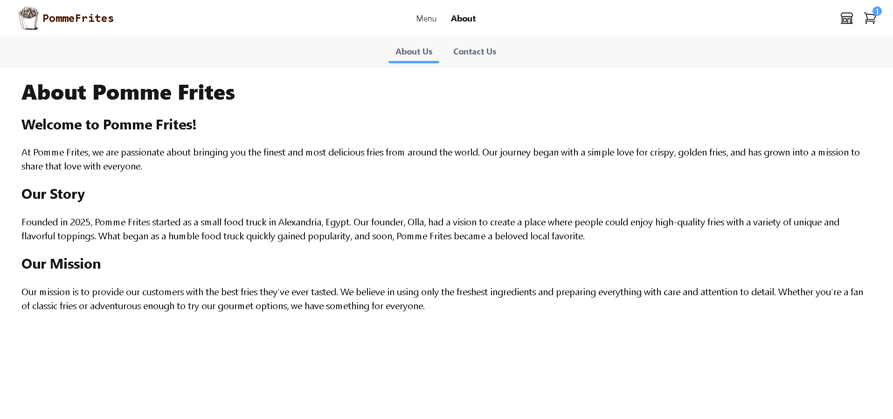
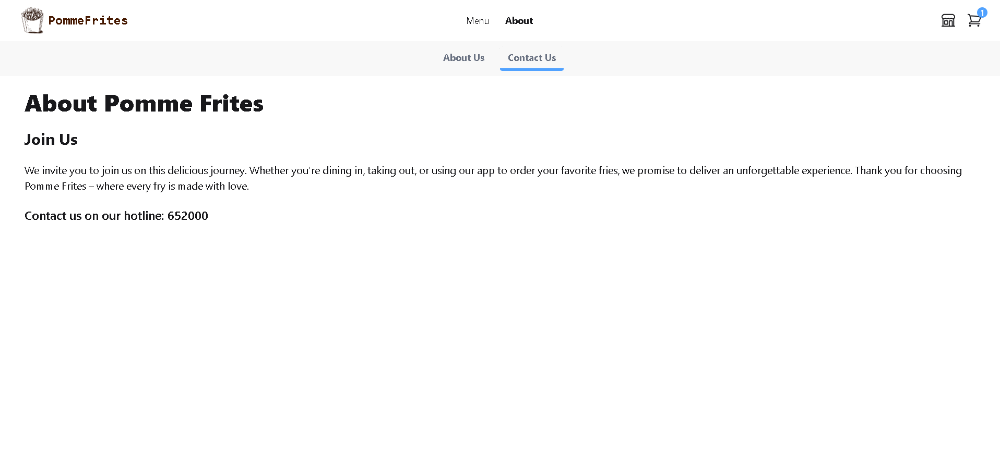

# 🍟 PommeFrites Menu Application

A modern and responsive menu web app for a fast-food restaurant, built using **ReactJS**. This application showcases the menu, item details, and provides a visually engaging user experience.

---

## 📸 Preview
### Menu page

### Cart page

### Admin page

### About us

## 🚀 Features

- 🍟 Browse a variety of fries and combos
- 🧾 View detailed item info including images and prices
- 💬 Cart 
- 🔎 Search and filter menu 
- 📱 Mobile-friendly and fully responsive design
- 🎨 Clean UI with reusable components

---

## 🛠️ Tech Stack

- **ReactJS**
- **TailwindCSS / DaisyUI**

---

